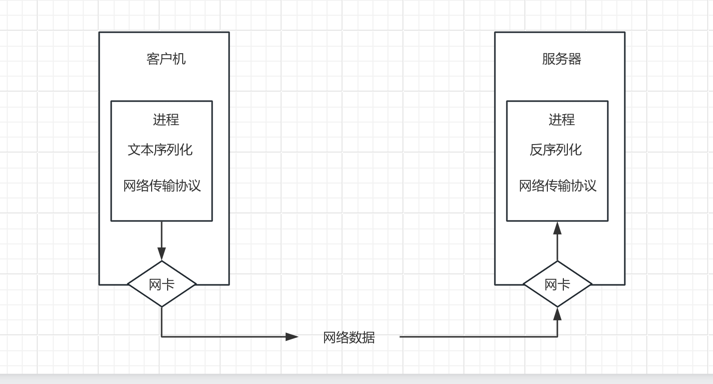
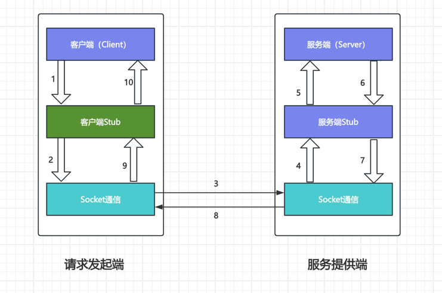

# 什么是rpc
1. rpc（remote procedure call）远程过程调用，简单的理解是一个节点请求另一个节点提供的服务
2. 对应rpc的是本地过程调用，函数调用是最常见的本地过程调用
3. 将本地过程调用变成远程过程调用会面临各种问题

```
def add(a,b):
    total = a + b
    return total
total = add(1,2)
print(total)
```
函数调用过程：
1. 将 1和2 压入add函数的栈
2. 进入add函数，从栈中取出1和2分别赋值给a和b
3. 执行a+b将结果赋值给局部的total并压栈
4. 将栈中的值取出来赋值给全局的total

## 远程过程面临的问题
1. 原本的本地函数放到另一个服务器上去运行，引入很多新问题
2. Call的id映射
3. **序列化和反序列化**
4. **网络传输**

### 远程过程调用带来的新问题
在远程调用时，需要执行的函数时在远程的机器上的，也就是说，add是在另一个进程中执行的，这就带来了几个新问题
1. **Call ID映射**：怎么告诉远程机器要调用add，而不是sub或者Foo呢？ 在本地调用中，函数体是直接通过函数指针来指定的，
调用add，编译器就自动帮我们调用他相应的函数指针，但是在远程调用中，函数指针是不行的，因为两个进程的地址空间是完全不一样的。
所以，在rpc中，所有的函数都必须有自己的一个ID，这个ID在所有的进程中都是唯一确定的，客户端在做远程过程调用是，必须附上这个id
然后还需要在客户端和服务端分别维护一个（函数<---> Call ID）的对应表。两者的表不一定需要完全相同，但相同的函数对应的Call ID必须相同。
当客户端需要进行远程调用时，它就查一下这个表，找出相应的Call ID，然后把它传给服务端，服务端也通过查表，来确定客户端需要调用的函数，
然后执行相应函数的代码
2. **序列化和反序列化**：客户端怎么把参数值传给远程的函数呢？在本地调用中，只需要把参数压到栈中，然后让函数自己去栈里读就行，
但是在远程过程调用时，客户端服务端是不同的进程。不能通过内存来传递参数。甚至有时候客户端和服务端使用的都不是同一种语言（比如
服务端用c++，客户端用java或者python）。这时候就需要客户端把参数先转成一个字节流，传给服务端后，再把字节流转成自己能读取的格式。
这个过程叫序列化和反序列化。同理，从服务端返回的值也需要序列化和反序列化的过程。
3. **网络传输**：远程调用往往用在网络上，客户端和服务端是通过网络连接的，所有的数据都需要通过网络传输，因此就需要有一个网络传输层，
网络传输层需要把call id 和序列化后的参数字节流传给服务端，然后再把序列化后的调用结果传回客户端，只要能完成这两者，都可以作为
传输层使用，因此，它所使用的协议其实是不限的，能完成传输就行，尽管大部分rpc框架都使用tcp协议，但其实udp也可以，而 GRPC 干脆
就用了HTTP2，Java的Netty也属于这层的东西。

### http协议
对于http协议来说，有一个问题，就是一次性
一旦返回了结果，连接断开，再使用时，再次连接

http2.0 能保持长连接

### RPC的调用过程


解决了上面三个机制，就能实现RPC了，具体过程如下：
**client端解决的问题**
> 1. 将这个调用映射为Call ID，这里假设用最简单的字符串当 Call ID的方法
> 2. 将Call ID，a和b序列化，可以直接将它们的值以二进制形式打包
> 3. 把2中得到的数据包发送给 ServerAddr，这需要使用网络传输层
> 4. 等待服务器返回结果
> 5. 如果服务器调用成功，那么就将结果反序列化，并赋给total

**Server端解决的问题**
> 1. 在本地维护一个Call ID到函数指针的映射 call_id_map，可以用 dict 完成
> 2. 等待请求，包括多线程的并发处理能力
> 3. 得到一个请求后，将其数据包反序列化，得到Call ID
> 4. 通过 call_id_map中查找，得到相应的函数指针
> 5. 将a和b反序列化，在本地调用add函数，得到结果
> 6. 将结果序列化后通过网络返回给 Client

在上面的整个流程中，存在计算机网络的流程和web服务器的定义
所以要实现一个 RPC 框架，其实只需要按以上流程实现就基本完成了

其中：
- Call ID 映射可以直接使用函数数字字符串，也可以使用整数ID，映射表一般就是一个哈希表
- 序列化和反序列化可以自己写，也可以使用Protobuf或者FlatBuffers之类的
- 网络传输库可以自己写 socket，或者用 asio、ZeroMQ、Netty之类的

## RPC演化

1. 基础形式调用（最核心的是什么）

- Call id ： 也就是 add 方法
- 数据的序列化和反序列化： 使用的 json数据格式
- 网络传输： http

**server/main.go**
```go
package main

import (
	"encoding/json"
	"fmt"
	"net/http"
	"strconv"
)

func main() {
	http.HandleFunc("/add", func(w http.ResponseWriter, r *http.Request) {
		_ = r.ParseForm() // 解析参数
		fmt.Println("path:" + r.URL.Path)
		a, _ := strconv.Atoi(r.Form["a"][0])
		b, _ := strconv.Atoi(r.Form["b"][0])
		w.Header().Set("Content-Type", "application/json")
		bytes, _ := json.Marshal(map[string]int{
			"data": a + b,
		})
		_, _ = w.Write(bytes)
	})

	_ = http.ListenAndServe(":8000", nil)
}

```

**client/main.go**
```go
package main

import (
	"encoding/json"
	"fmt"
	"io"
	"net/http"
)

type ResponseData struct {
	Data int `json:"data"`
}

func Add(a, b int) int {
	response, err := http.Get(fmt.Sprintf("http://%s:%d/%s?a=%d&b=%d", "127.0.0.1", 8000, "add", a, b))
	if err != nil {
		return 0
	}
	defer response.Body.Close()
	bytes, err := io.ReadAll(response.Body)
	fmt.Println(string(bytes))
	respData := ResponseData{}
	_ = json.Unmarshal(bytes, &respData)
	return respData.Data
}

func main() {
	fmt.Println(Add(2, 2))
}

```

## RPC开发要素分析
**rpc开发的四大要素**
1. RPC技术在架构设计上有四部分组成：**客户端**、**客户端存根**、**服务端**、**服务端存根**
- **客户端（Client）**：服务调用发起方，也称为服务消费者
- **客户端存根（Client Stub）**：该程序运行在客户端所在的计算机上，主要用来存储要调用的服务器的地址、
另外，该程序还负责将请求服务端所需的参数打包成数据包，通过网络发送给服务端Stub程序；其次，还要接收服务端的Stub
返回的结果数据包，并将数据包解析返回给客户端
- **服务端（Server）**：远程服务器上运行的程序，其中包含客户端要调用的方法
- **服务端存根（Server Stub）**：接收客户端Stub程序通过网络发送过来的数据包，并调用服务端对应的真正方法，
完成功能调用，将服务端调用返回的结果打包成数据包发送给客户端Stub


在图中，说明了RPC每一步的调用过程，具体描述为：
1. 客户端要发起一个远程过程调用，首先通过调用本地客户端Stub程序的方法调用想要使用的功能方法名
2. 客户端Stub程序接收到了客户端的功能调用请求，**将客户端请求调用的方法名，携带的参数等信息做序列化操作**
**并打包成数据包**
3. 客户端Stub查找到远程服务器程序的IP地址，调用Socket通信协议，通过网络发送给服务端
4. 服务端Stub程序接收到客户端发送的数据包信息，并**通过约定好的协议将数据进行反序列化，得到请求的方法名和请求参数信息**
5. 服务器端Stub程序准备相关数据，**调用本地服务端对应的方法，并传入相应的参数，进行业务处理**
6. 服务端程序根据已有业务逻辑执行调用过程，待业务执行结束，将执行结果返回给客户端Stub程序
7. 服务端Stub程序**将程序调用结果按照预定的协议进行序列化，并通过网络发送回客户端Stub程序**
8. 客户端Stub程序接收到服务端Stub返回的数据，**对数据进行反序列化操作，并将调用返回的数据传给客户端请求发起者**
9. 客户端请求发起者得到调用结果，整个RPC调用过程结束

## rpc需要使用到的术语
1. **动态代理**：上文中提到的 Client Stub和Server Stub程序，在具体的编码和开发是实践过程中，都是使用动态代理技术自动
生成的一段程序
2. **序列化和反序列化**：在RPC调用过程中，可以看到数据需要在一台机器上传输到另一台机器上，在互联网上，
所有的数据都是以字节的形式进行传输的，而在编程的过程中，往往都是使用数据对象，因此想要在网络上将数据对象
和相关变量进行传输，就需要对数据对象进行序列化和反序列化的操作
- **序列化**：把对象转换为字节序列的过程称为对象的序列化，也就是编码的过程
- **反序列化**：把字节序列恢复为对象的过程称为对象的反序列化，也就是解码的过程
常见的JSON、XML等相关框架都可以对数据做序列化和反序列化编解码操作，Protobuf协议，也是一种数据编解码的协议


# go 内置 RPC 使用默认序列化协议 Gob

**server/server.go**
```go
package main

import (
	"net"
	"net/rpc"
)

type HelloService struct{}

func (h *HelloService) Hello(request string, reply *string) error {
	// 返回值通过 reply 修改
	*reply = "hello " + request
	return nil
}

func main() {
	// 1. 实例话server
	listener, err := net.Listen("tcp", ":1234")
	if err != nil {
		panic("net.Listen error:" + err.Error())
	}
	// 2. 注册处理逻辑 handler
	err = rpc.RegisterName("HelloService", &HelloService{})
	if err != nil {
		panic("rpc.RegisterName error:" + err.Error())
	}
	// 3. 启动服务
	conn, err := listener.Accept() // 当新的连接进来的时候
	if err != nil {
		panic("listener.Accept error:" + err.Error())
	}
	rpc.ServeConn(conn)
}

```

**client/client.go**
```go
package main

import (
	"fmt"
	"net/rpc"
)

func main() {
	// 1. 建立连接
	// 此处使用rpc.Dial的原因是因为使用的是go的默认内置编码 gob 编码
	client, err := rpc.Dial("tcp", "localhost:1234")
	if err != nil {
		panic("rpc.dial error:" + err.Error())
	}
	str := "qqqq"
	var reply string
	err = client.Call("HelloService.Hello", str, &reply)
	if err != nil {
		panic("client.Call error : " + err.Error())
	}
	fmt.Println("reply:" + reply)
}

```

# json_rpc_test 序列化协议更换为json
**server/server.go**
```go
package main

import (
	"net"
	"net/rpc"
	"net/rpc/jsonrpc"
)

type HelloService struct{}

func (h *HelloService) Hello(request string, reply *string) error {
	*reply = "Json_rep_test, Hello " + request
	return nil
}
func main() {
	//1. 创建监听端口
	listener, err := net.Listen("tcp", ":1234")
	if err != nil {
		panic("net.listen error:" + err.Error())
	}
	// 2. 注册处理逻辑
	err = rpc.RegisterName("HelloService", &HelloService{})
	if err != nil {
		panic("rpc.Register error:" + err.Error())
	}

	// 使用for的目的是防止请求一次后，自动关闭
	for {
		// 3. 启动服务
		conn, err := listener.Accept()
		if err != nil {
			panic("listener. accpet error : " + err.Error())
		}

		// 4. 处理连接
		//rpc.ServeConn(conn)
		// 此处开始发生变化

		// 变更时间
		// 使用 go 的目的是处理并发
		go rpc.ServeCodec(jsonrpc.NewServerCodec(conn))
	}

}

```

**client/client.go**
```go
package main

import (
	"fmt"
	"net"
	"net/rpc"
	"net/rpc/jsonrpc"
)

func main() {

	// 1. 建立连接
	// 此处变更为 net.Dial 是因为修改了rpc的编码，所以不再使用 rpc.Dial
	conn, err := net.Dial("tcp", "localhost:1234")
	if err != nil {
		panic("net.Dial error:" + err.Error())
	}
	//2. 请求访问
	var reply string
	client := rpc.NewClientWithCodec(jsonrpc.NewClientCodec(conn))
	err = client.Call("HelloService.Hello", "aaa", &reply)
	if err != nil {
		panic("client.Call error:" + err.Error())
	}
	fmt.Println(reply)
}

```

**json_rpc_client.py**
```
import json
import socket

request = {
    "id":0,
    "params":["abc"],
    "method":"HelloService.Hello"
}

client = socket.create_connection(("localhost", "1234"))
client.sendall(json.dump(request).encode())

# 获取服务器返回的数据
rsp = client.recv(1024)
rsp = json.loads(rsp.decode())

print(rsp["result"])

```

# rpc 传输协议替换为 http
**server/server.go**
```go
package main

import (
	"io"
	"net/http"
	"net/rpc"
	"net/rpc/jsonrpc"
)

type HelloService struct{}

func (h *HelloService) Hello(request string, reply *string) error {
	*reply = "http_rpc Hello " + request
	return nil
}
func main() {
	// 1. 创建连接
	_ = rpc.RegisterName("HelloService", &HelloService{})
	http.HandleFunc("/jsonrpc", func(w http.ResponseWriter, r *http.Request) {
		var conn io.ReadWriteCloser = struct {
			io.Writer
			io.ReadCloser
		}{
			ReadCloser: r.Body,
			Writer:     w,
		}
		_ = rpc.ServeRequest(jsonrpc.NewServerCodec(conn))
	})
	_ = http.ListenAndServe(":1234", nil)
}

```
**json_rpc_http_client.py**
```
import requests

request = {
    "id":0,
    "params":["ffff"],
    "method":"HelloService.Hello"
}
rsp = requests.post("http://localhost:1234/jsonrpc", json=request)
print(rsp.text)

```

# rpc 进一步升级改造 提取公共部分进行封装
**server/server.go**
```go
package main

import (
	"net"
	"net/rpc"
	"study/upgrade_rpc/handler"
	"study/upgrade_rpc/server_proxy"
)

// 将此部分优化到 handler中
//type HelloService struct {
//}
//
//func (h *HelloService) Hello(request string, reply *string) error {
//	*reply = "Hello upgrade_rpc " + request
//	return nil
//}

func main() {
	// 1. 创建监听
	listener, err := net.Listen("tcp", ":1234")
	if err != nil {
		panic("net.listen error:" + err.Error())
	}
	// 2. 注册客户端调用方法
	//err = rpc.RegisterName(handler.HelloServiceName, &handler.HelloService{})
	//优化后
	// &handler.NewHelloService{} newHelloService 实现了 Hello方法，所以它就是 HelloService 鸭子类型
	//_ = server_proxy.RegisterHelloService(&handler.NewHelloService{})
	_ = server_proxy.RegisterHelloService(&handler.NewnewHello{})
	if err != nil {
		panic("rpc.RegisterName error: " + err.Error())
	}

	// 防止连接后就断开使用for
	for {
		// 3. 监听连接
		conn, err := listener.Accept()
		if err != nil {
			panic("listener.accept error:" + err.Error())
		}
		// 执行连接操作
		go rpc.ServeConn(conn)
	}
}

```

**server_proxy/server_proxy.go**
```go
package server_proxy

import (
	"net/rpc"
	"study/upgrade_rpc/handler"
)

type HelloServicer interface {
	Hello(request string, reply *string) error
}

func RegisterHelloService(srv HelloServicer) error {
	return rpc.RegisterName(handler.HelloServiceName, srv)
}

```

**handler/handler.go**
```go
package handler

// 加前缀是为了解决名称冲突的问题
const HelloServiceName = "handler/HelloService"

type NewHelloService struct {
}

func (h *NewHelloService) Hello(request string, reply *string) error {
	*reply = "Hello handler " + request
	return nil
}

type NewnewHello struct {
}

func (n *NewnewHello) Hello(request string, reply *string) error {
	*reply = "Hello newnewhello" + request
	return nil
}

```

**client/client.go**
```go
package main

import (
	"fmt"
	"study/upgrade_rpc/client_proxy"
)

func main() {
	// 1. 建立连接
	//client, err := rpc.Dial("tcp", "localhost:1234")
	//if err != nil {
	//	panic("rpc.Dial error" + err.Error())
	//}
	// 优化后
	client := client_proxy.NewHelloServiceClient("tcp", "localhost:1234")

	// 2. 执行调用
	//var reply string
	//err = client.Call(handler.HelloServiceName+".Hello", "nihao", &reply)
	//if err != nil {
	//	panic("client call error" + err.Error())
	//}
	// 优化后
	var reply string
	err := client.Hello("youhua", &reply)
	if err != nil {
		panic("client hello 调用失败" + err.Error())
	}
	fmt.Println(reply)
}

```

**client_proxy/client_proxy.go**
```go
package client_proxy

import (
	"net/rpc"
	"study/upgrade_rpc/handler"
)

type HelloServiceStub struct {
	*rpc.Client
}

func NewHelloServiceClient(protol, addr string) HelloServiceStub {
	conn, err := rpc.Dial(protol, addr)
	if err != nil {
		panic("new helloService err" + err.Error())
	}
	return HelloServiceStub{conn}
}

func (c *HelloServiceStub) Hello(request string, reply *string) error {
	err := c.Call(handler.HelloServiceName+".Hello", request, reply)
	if err != nil {
		return err
	}
	return nil
}

```